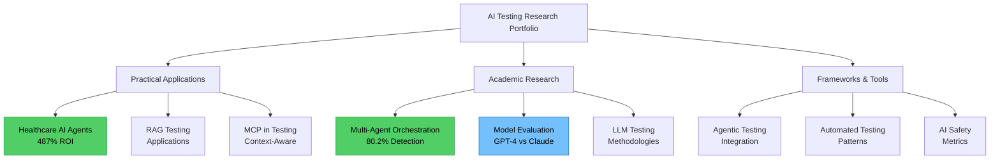

# [Elena Mereanu - AI-First Quality Engineer](https://elamcb.github.io)

> Building reliable AI systems through rigorous testing and automation

[](https://elamcb.github.io)
[](https://linkedin.com/in/elenamereanu)
[](https://github.com/ElaMCB/ElaMCB.github.io/stargazers)
[](https://github.com/ElaMCB/ElaMCB.github.io/commits/main)


## AI Research Notebooks

### Research Map



### Quick Reference Table

| Research Paper | Type | Key Results | Primary Focus | Tech Stack |
|----------------|------|-------------|---------------|------------|
| [Healthcare AI Agents](./research/notebooks/ai-agents-qa-healthcare.html) | Case Study | 487% ROI, 92% coverage | Why use AI agents? | LangChain, Playwright |
| [Multi-Agent Orchestration](./research/notebooks/multi-agent-orchestration-framework.html) | Academic | 80.2% detection, 31% cost ↓ | Optimal architecture | ATAO Framework |
| [Model Evaluation](./research/notebooks/model-evaluation-software-testing.html) | Framework | GPT-4 vs Claude vs Gemini | Which AI model to use? | Python, pandas |
| [Agentic Testing](./research/notebooks/agentic-testing-integration.html) | Integration | Multi-agent systems | Implementation guide | AutoGPT, LangChain |
| [MCP Testing](./research/notebooks/mcp-software-testing.html) | Framework | Context-aware testing | Dynamic adaptation | MCP Protocol |
| [RAG Testing](./research/notebooks/rag-testing-applications.html) | Applications | Test generation from docs | Knowledge retrieval | RAG, Vector DBs |
| [LLM Methodologies](./research/notebooks/llm-testing-analysis.html) | Analysis | Hallucination detection | Testing LLMs | Safety frameworks |
| [AI Safety Metrics](./research/notebooks/ai-safety-metrics.html) | Metrics | Prompt injection detection | Security validation | Safety evaluators |
| [Testing Patterns](./research/notebooks/automated-testing-patterns.html) | Patterns | AI-augmented automation | Best practices | Pytest, CI/CD |

### Featured Research

<details>
<summary><b>Why Use AI Agents for Testing? - Healthcare Case Study</b> (Practical)</summary>

**Impact:** 487% ROI • 92% coverage • 88% faster tests  
**Focus:** Autonomous testing with 7 specialized agents (Explorer, Generator, Security, Compliance)  
**Tags:** `AI-agents` `healthcare-QA` `HIPAA-compliance` `autonomous-testing`  
**[View](./research/notebooks/ai-agents-qa-healthcare.html)** | **[Download](./research/notebooks/ai-agents-qa-healthcare.ipynb)**
</details>

<details>
<summary><b>Multi-Agent Orchestration Framework</b> (Academic Research)</summary>

**Impact:** 80.2% detection • 31% cost reduction • 15% improvement  
**Focus:** Comparing 4 architectures (Monolithic, Manager-Worker, Swarm, Pipeline) with 50-trial validation  
**Tags:** `multi-agent-systems` `test-orchestration` `manager-worker` `agent-architecture`  
**[View](./research/notebooks/multi-agent-orchestration-framework.html)** | **[Download](./research/notebooks/multi-agent-orchestration-framework.ipynb)**
</details>

<details>
<summary><b>Evaluating AI Models for Software Testing</b> (Framework)</summary>

**Impact:** Comprehensive model comparison framework  
**Focus:** GPT-4 • Claude 3.5 • Gemini Pro • CodeLlama benchmarking  
**Tags:** `AI-model-evaluation` `LLM-benchmarking` `GPT-4` `Claude`  
**[View](./research/notebooks/model-evaluation-software-testing.html)** | **[Download](./research/notebooks/model-evaluation-software-testing.ipynb)**
</details>

**[View All 9 Research Notebooks →](./research/)** | **[Complete Research Index](./research/notebooks/README.md)**

---

## Featured Projects

### LLMGuardian - Production AI Testing Framework
*Advanced validation for Large Language Models with RAG, MCP, and safety testing*

**Impact:** 23% accuracy improvement • 60% faster testing • 3 critical safety violations prevented  
**Tech:** JavaScript/Node.js, AI APIs, RAG, MCP  
**Tags:** `LLM-testing` `AI-safety` `RAG` `MCP` `production-AI`  
**[Live Demo](./llm-guardian/demo.html)** | **[Documentation](./llm-guardian/)** | **[Case Studies](./llm-guardian/case-studies/)**

### Legacy-AI Bridge Framework  
*Gradual AI integration for enterprise systems without disruption*

**Impact:** 40% faster processing • 60% fraud reduction • Zero downtime migration  
**Tech:** Python, Legacy System Integration, AI/ML Pipeline  
**[Framework Details](./legacy-ai-bridge/)** | **[Assessment Tool](./legacy-ai-bridge/assessment-template.md)**

### Job Search Automation Suite
*Ethical AI-powered automation for career management*

**Impact:** 60% time reduction • 85% job matching accuracy • Improved application quality  
**Tech:** Python, Playwright, AI/ML, React/TypeScript  
**[Project Details](./job-search-automation/)** | **[Demo Screenshots](./job-search-automation/demo-screenshots.md)**

### Algorithmic Trading System
*Systematic quantitative trading with risk management*

**Performance:** +127% total return • 1.67 Sharpe ratio • 64% win rate  
**Tech:** Python, pandas, Statistical Analysis, Risk Management  
**[Strategy Details](./algorithmic-trading/)** | **[Implementation](./algorithmic-trading/strategy-implementation.md)**

[**View All Projects →**](./PROJECTS.md)

## Fun

### AI vs Human: Code Detective Challenge
*Test your skills at distinguishing AI-generated code from human-written code*

Can you spot the difference between code written by AI and code written by humans? This interactive game presents real code snippets and challenges you to identify their origin. Learn the subtle patterns that distinguish AI coding style from human creativity and problem-solving approaches.

**Features:**
- 6 diverse code examples from simple functions to complex implementations
- Real-time scoring and accuracy tracking
- Educational explanations for each code snippet
- Mobile-responsive futuristic design
- No registration required - jump right in!

**[Play the Game →](https://elamcb.github.io#fun-zone)**

*Challenge yourself: Can you achieve 80%+ accuracy and earn the "AI Code Detective" title?*

## Recognition

### GitHub Metrics


### Impact Metrics
- **Projects Deployed**: 4 production systems
- **Performance Improvement**: 23-60% across projects  
- **Testing Coverage**: 85%+ automated validation
- **AI Frameworks**: RAG, MCP, LLM testing, safety validation

## Star History
[](https://star-history.com/#ElaMCB/ElaMCB.github.io&Date)

## Contributing

Found this useful? Here's how you can help:
- **Star the repo** to show support
- **Report issues** you encounter  
- **Suggest improvements** via [issues](https://github.com/ElaMCB/ElaMCB.github.io/issues)
- **Share** with your network

### Community Engagement
- **[Issues](https://github.com/ElaMCB/ElaMCB.github.io/issues)**: Join the conversation about AI-First development
- **[Issues](https://github.com/ElaMCB/ElaMCB.github.io/issues)**: Report bugs or request features
- **[Contributors](https://github.com/ElaMCB/ElaMCB.github.io/graphs/contributors)**: See who's helping build this project

## Learning Resources

### AI-First Development Guides
- **[Prompt Engineering Guide](./docs/PROMPT-ENGINEERING-GUIDE.md)** - Master effective AI prompting techniques
- **[AI Workflow Integration](./docs/AI-WORKFLOW-INTEGRATION.md)** - Integrate AI into daily development workflows  
- **[AI-First Principles](./docs/AI-FIRST-PRINCIPLES.md)** - Core philosophy and development approach
- **[AI Adoption Roadmap](./docs/AI-ADOPTION-ROADMAP.md)** - Step-by-step guide for teams adopting AI

### Quick Start
**New to AI-First development?** Start here: **[START HERE Guide](./docs/START-HERE.md)**

**Want to customize this template?** See: **[Customization Guide](./docs/CUSTOMIZATION.md)**

## Architecture

### Repository Structure
```
├── llm-guardian/                 # LLM Testing Framework (Flagship Project)
│   ├── README.md                 # Framework documentation
│   ├── demo.html                 # Interactive demonstrations
│   ├── index.html                # Main entry point
│   ├── src/                      # Core framework code
│   │   ├── evaluators/           # Testing evaluators
│   │   ├── llm-tester.js         # Main testing interface
│   │   ├── rag-evaluator.js      # RAG system evaluation
│   │   ├── safety-evaluator.js   # Safety validation
│   │   └── mcp-server.js         # MCP integration
│   ├── examples/                 # Usage examples
│   │   └── demo.js               # Demo implementations
│   ├── case-studies/             # Real-world implementations
│   │   ├── README.md
│   │   ├── financial-services-chatbot.md
│   │   └── ecommerce-recommendations.md
│   └── reasoning-examples/       # Extended thinking examples
│       └── test-planning-reasoning.md
├── legacy-ai-bridge/             # Enterprise AI integration framework
│   ├── README.md                 # Framework overview
│   └── assessment-template.md    # Legacy system evaluation
├── job-search-automation/        # AI automation project
│   ├── README.md                 # Project documentation
│   ├── demo-screenshots.md       # Visual demonstrations
│   └── ethical-automation-guide.md
├── algorithmic-trading/          # Quantitative trading project
│   ├── README.md                 # Strategy overview and results
│   └── strategy-implementation.md # Technical implementation
├── qa-prompts/                   # AI prompt library for QA/SDET
│   ├── README.md                 # Library overview
│   ├── prompts/                  # Categorized prompt collections
│   │   ├── test-generation.md
│   │   ├── api-testing.md
│   │   ├── code-generation.md
│   │   └── mobile-testing.md
│   └── examples/
│       └── sample-outputs.md
├── research/                     # AI Research & Jupyter Notebooks
│   ├── index.html                # Research landing page
│   ├── notebooks/                # Jupyter notebook collection
│   │   ├── README.md             # Complete notebook index with tags
│   │   ├── ai-agents-qa-healthcare.ipynb       # Healthcare AI agents case study
│   │   ├── ai-agents-qa-healthcare.html        # HTML viewer
│   │   ├── model-evaluation-software-testing.ipynb # AI model evaluation framework
│   │   ├── model-evaluation-software-testing.html  # HTML viewer
│   │   ├── agentic-testing-integration.ipynb   # Agentic testing research
│   │   ├── agentic-testing-integration.html    # HTML viewer
│   │   ├── mcp-software-testing.ipynb          # MCP applications
│   │   ├── mcp-software-testing.html           # HTML viewer
│   │   ├── rag-testing-applications.ipynb      # RAG for testing
│   │   ├── rag-testing-applications.html       # HTML viewer
│   │   ├── llm-testing-analysis.ipynb          # LLM testing methodologies
│   │   ├── llm-testing-analysis.html           # HTML viewer
│   │   ├── ai-safety-metrics.ipynb             # AI safety metrics
│   │   ├── ai-safety-metrics.html              # HTML viewer
│   │   ├── automated-testing-patterns.ipynb    # Testing patterns
│   │   └── automated-testing-patterns.html     # HTML viewer
│   └── papers/                   # Research papers
│       ├── automated-testing-patterns.md
│       └── automated-testing-patterns.html
├── docs/                         # Learning resources and guides
│   ├── PROMPT-ENGINEERING-GUIDE.md
│   ├── AI-WORKFLOW-INTEGRATION.md
│   ├── AI-FIRST-MANIFESTO.md
│   ├── AI-FIRST-PRINCIPLES.md
│   ├── AI-ADOPTION-ROADMAP.md
│   ├── START-HERE.md
│   ├── CUSTOMIZATION.md
│   ├── ARCHITECTURE.md
│   ├── FEATURES.md
│   ├── DEVELOPMENT-TIMELINE.md
│   └── SEO-AND-DISCOVERABILITY-GUIDE.md
├── learn/                        # Interactive learning hub
│   ├── index.html                # Learning portal
│   └── README.md
├── screenshots/                  # Project screenshots
│   └── README.md
├── .github/                      # GitHub configuration
│   └── workflows/                # CI/CD pipelines
├── images/                       # Assets and media
│   ├── profile.jpg
│   ├── ela-mcb-metallic.jpg
│   ├── favicon.svg
│   └── site.webmanifest
├── index.html                    # Main portfolio page
├── analytics.html                # Analytics dashboard
├── ANALYTICS-README.md           # Analytics documentation
├── PROJECTS.md                   # Complete project list
├── CONTRIBUTING.md               # Contribution guidelines
├── LICENSE                       # MIT License
└── README.md                     # This file
```

### Development Approach

This portfolio demonstrates **AI-First development practices** using advanced AI systems:

- **Rapid Prototyping**: Complete portfolio architecture designed and implemented in 1-2 days instead of 2-3 weeks
- **AI-Assisted Development**: Leveraged multiple AI systems for code generation, optimization, and rapid iteration
- **Human-AI Collaboration**: Strategic decisions, domain expertise, and quality control maintained by human developer
- **Efficiency Gains**: ~10x faster development cycle through intelligent automation and AI pair programming
- **Technical Partnership**: Advanced AI systems as development accelerators and code generation partners

### AI Contributors
This project was built using AI-First development practices with:
- **[Cursor AI Agentic Mode](https://cursor.sh)** - Advanced code generation and pair programming
- **[Void IDE](https://voideditor.com)** - AI-powered development environment and workflow automation
- **[Claude 4 Sonnet](https://claude.ai)** - Architecture planning, documentation, and complex reasoning
- **[DeepSeek AI](https://deepseek.com)** - Rapid iteration and optimization support
- **[DeepSeek Coder](https://deepseek.com)** - Specialized code generation and technical implementation

### Real-World Examples
Every technique in our guides was used to build this portfolio:
- **Complete HTML/CSS generation** with AI assistance for rapid iteration
- **Advanced AI frameworks** (RAG, MCP, LLM testing) implemented with AI assistance
- **Production-ready CI/CD** pipeline configured with AI guidance

**Perfect for**: Developers wanting to 10x their productivity, QA engineers transitioning to AI-first practices, and teams adopting AI-assisted development workflows.

## Repository Activity
[](https://github.com/ElaMCB/ElaMCB.github.io/graphs/commit-activity)

## License

MIT License - feel free to use this template for your own portfolio!

```bibtex
@portfolio{elamcb2025,
    address = {USA},
    author = {Elena Mereanu},
    title = {{AI-First Quality Engineering Portfolio}},
    url = {https://elamcb.github.io},
    linkedin = {https://linkedin.com/in/elenamereanu},
    github = {https://github.com/ElaMCB},
    year = {2025}
}
```

---